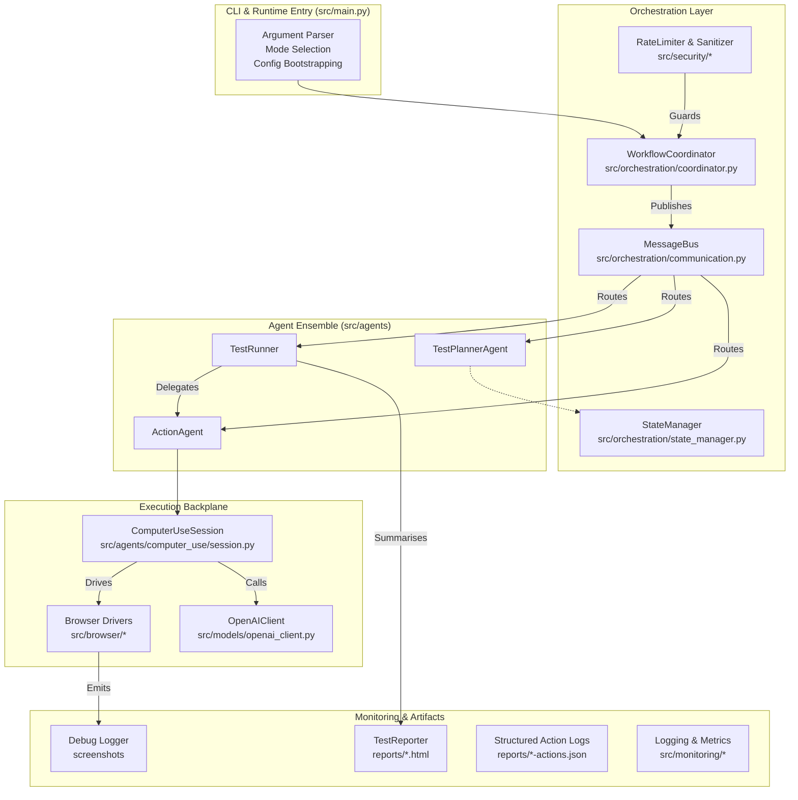
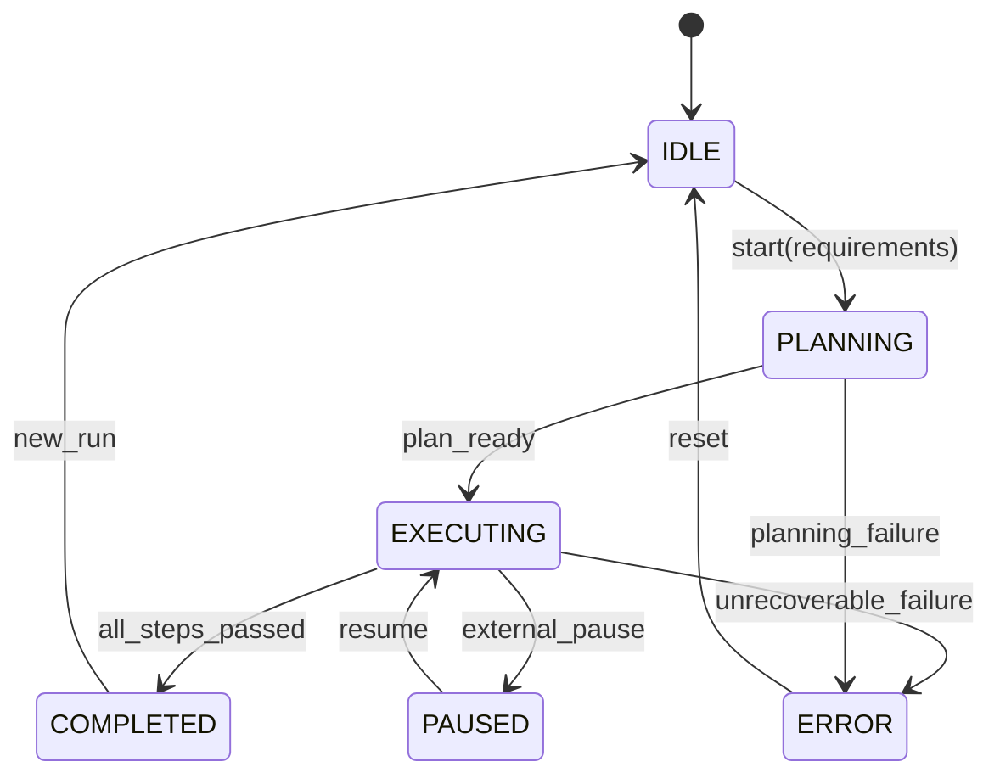

# HAINDY System Architecture

## Overview
HAINDY is an autonomous QA platform that converts natural-language requirements into executable web tests. The runtime orchestrates an ensemble of AI agents, a Playwright-driven browser, OpenAI’s computer-use model, and rich observability tooling to deliver end-to-end testing without manual intervention. This document captures the overarching architecture, major subsystems, and operational flows so that contributors—human or AI—can understand how the tool is assembled.

## Layered Architecture
The platform is organised into layers that isolate concerns yet communicate through typed messages and shared state.



## End-to-End Execution Sequence
The typical “requirements to report” flow involves multiple request/response cycles among agents and the execution backplane.

```mermaid
sequenceDiagram
    participant CLI as CLI / src/main.py
    participant Coord as WorkflowCoordinator
    participant Planner as TestPlannerAgent
    participant Runner as TestRunner
    participant Action as ActionAgent
    participant CU as ComputerUseSession
    participant Browser as Playwright/Instrumented Driver
    participant Reporter as TestReporter

    CLI->>Coord: initialise(requirements, flags)
    Coord->>Planner: generate_test_plan(requirements)
    Planner-->>Coord: test_plan (TestPlan)
    Coord->>Runner: execute_test_plan(test_plan, initial_url)
    loop For each test step
        Runner->>Action: execute_action(step_context)
        alt Step requires computer-use
            Action->>CU: run(goal, screenshot, metadata)
            CU->>Browser: start() / screenshot()
            loop computer_use turns
                CU->>OpenAI: responses.create(...)
                CU<--OpenAI: computer_call output
                CU->>Browser: click / type / press / scroll
                Browser-->>CU: state snapshots
            end
            CU-->>Action: EnhancedActionResult
        else Non-computer-use workflow
            Action->>Browser: direct navigate/click/etc
        end
        Action-->>Runner: EnhancedActionResult
        Runner->>Reporter: append_step_result(...)
    end
    Runner-->>Coord: final TestState
    Coord-->>CLI: render summary + report paths
```

## Component Breakdown

### CLI & Runtime Entry (`src/main.py`)
- Parses CLI flags (`--plan`, `--requirements`, `--berserk`, etc.) and loads configuration via `get_settings`.
- Bootstraps logging, rate limiting, sanitization, OpenAI credentials, and debug logging directories.
- Depending on mode, either generates plans, executes scenarios, or runs diagnostics.
- Instantiates `WorkflowCoordinator`, `BrowserController`, `TestReporter`, and manages lifecycle (start/stop browser, persist artifacts).

### Orchestration Layer
- **WorkflowCoordinator** (`src/orchestration/coordinator.py`): central state machine that wires agents together, enforces execution phases (planning → execution), and manages concurrency.
- **MessageBus** (`src/orchestration/communication.py`): async publish/subscribe bus; keeps message history, per-agent queues, and statistics, enabling loose coupling between agents.
- **StateManager** (`src/orchestration/state_manager.py`): creates and mutates `TestState` objects, persisting step-level outcomes, blocker flags, and execution history.
- **Security Utilities** (`src/security/rate_limiter.py`, `src/security/sanitizer.py`): throttle API usage and scrub sensitive data before logging or storing.

### Agent Layer (`src/agents`)
- **TestPlannerAgent**: interprets requirements using OpenAI Responses, producing structured `TestPlan` objects with cases and steps. Uses streaming observers for rich CLI feedback.
- **TestRunner**: executes plan sequentially; for each step it decomposes intent into action instructions, maintains execution history, triggers action execution, performs AI-based verification, and generates bug reports.
- **ActionAgent**: translates each planned action into concrete execution via the Computer Use workflow or manual grid-based routines. Tracks conversation history for logging, enforces interaction modes, and packages `EnhancedActionResult` objects.

### Computer Use Integration (`src/agents/computer_use/session.py`)
- Wraps OpenAI’s computer-use tool, maintaining a loop of screenshot → request → computer_call execution.
- Injects metadata (interaction mode, safety identifier, current URL, plan/case context) into each call.
- Enforces observe-only vs execute modes by restricting allowed action types; synthesises missing keypress/type payloads from step instructions when the model hesitates.
- Applies domain allow/block lists and fail-fast safety handling; mirrors all turns into `ComputerToolTurn` records with screenshots and timing.
- Automatically confirms “Should I proceed?” messages to keep workflows non-blocking.

### Browser & Environment Abstraction (`src/browser`)
- `PlaywrightDriver` handles Chromium startup, navigation, clicks, typing, scrolling, and screenshot capture with instrumentation hooks.
- `InstrumentedBrowserDriver` extends the base driver to record every API call (method, parameters, duration) for action logs.
- `BrowserController` orchestrates driver lifecycle, handles initial URL navigation, and coordinates with the coordinator.
- Viewport, headless, timeout, and launch flags come from `ConfigSettings`.

### OpenAI Client Layer (`src/models/openai_client.py`)
- Provides a resilient wrapper around OpenAI Responses and Chat Completion APIs with retry logic.
- Supports streaming via `ResponseStreamObserver` interface.
- Supplies helpers for structured outputs, image analysis, and computer-use requests while enforcing timeouts and logging telemetry.

### Monitoring, Reporting, and Artifacts (`src/monitoring`)
- **Logger**: consistent structured logging with contextual extras (step, action, turn IDs).
- **Debug Logger**: captures before/after screenshots, AI interactions, and saves them under `debug_screenshots/<run_id>/`.
- **TestReporter**: builds Markdown/HTML summaries, stores action logs, bug reports, and coverage data in `reports/<timestamp>/`.
- **Enhanced Reporter**: surfaces aggregated HTML linked from CLI output for quick triage.

### Configuration & Settings (`src/config`)
- `settings.py` wraps Pydantic settings; sources values from `.env`, environment, or defaults.
- Provides agent model configs (model name, temperature, reasoning level, modalities) and execution tunables (timeouts, domain allowlists, stabilization waits).
- Centralised constants keep agents consistent and simplify environment customisation (e.g., switching to different OpenAI endpoints or adjusting coverage thresholds).

### Security & Safety
- Rate limiting prevents runaway API usage in failure loops.
- Sanitizer strips secrets from logs, error messages, and stored prompts.
- Safety identifiers and observe-only enforcement keep computer-use actions auditable and limit unintended interactions.
- Browser runs with hardened Chromium flags (`--disable-extensions`, `--no-sandbox` where permitted) to reduce side effects.

### Data & Artifact Layout
- `test_scenarios/` – curated JSON/JSONL/markdown scenarios for regression.
- `reports/` – per-run folders containing HTML reports, action JSON, bug payloads.
- `debug_screenshots/` – per-run before/after and per-turn captures.
- `docs/design/` – architectural documentation (this file and the action-agent deep dive).
- `demo_journals/`, `journal/` – long-form run transcripts.

## Execution Control Flows
The coordinator leverages a phased state machine to prevent cross-talk between planning and execution. High-level states include `IDLE`, `PLANNING`, `EXECUTING`, `PAUSED`, `COMPLETED`, and `ERROR`. Each state transition is mediated by `StateManager` callbacks, enabling external tooling (e.g., future dashboards) to hook in.



## Extensibility Guidelines
- **Adding Agents**: register with `MessageBus`, define message subscriptions, and wire into `WorkflowCoordinator`. `StateManager` can persist agent-specific metadata in `TestState`.
- **Custom Actions**: extend `ActionAgent` workflows or add new grid workflows; ensure Computer Use payloads are enriched with the new metadata and update tests under `tests/test_computer_use_session.py`.
- **Reporter Plugins**: hook into `TestReporter` to push artefacts to bespoke sinks (e.g., dashboards, Slack) or augment HTML generation.
- **Browser Variants**: implement the `BrowserDriver` interface; swap in via settings to run against different engines or remote grids.

## Error Handling & Resilience
- Computer-use fail-fast safety stops execution if OpenAI flags potentially unsafe actions.
- Action Agent synthesises missing keypress/type data to avoid silent no-ops and to bubble actionable errors.
- Test Runner treats failed critical steps as blockers, skip-marking subsequent cases when the environment is no longer meaningful.
- Coordinated logging and structured artefacts simplify post-mortem analysis—it is always possible to trace a bug report back to the exact computer-use turn and screenshot.

## Summary
HAINDY fuses orchestration, AI planning, and browser automation into a layered system. The coordinator and message bus keep agents loosely coupled; the Action Agent and Computer Use session enforce safe, deterministic interactions; monitoring components guarantee traceability. Developers can extend the system by adding agents, refining prompts, or swapping execution backends while relying on the established architecture.

