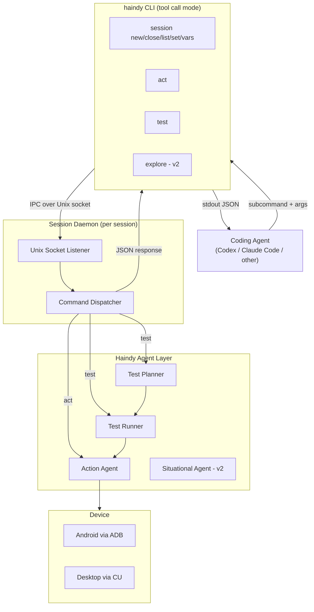

# Haindy Tool Call Mode - Overview

## Operating Modes

Haindy has two distinct operating modes. Understanding the difference is essential before reading anything else in this document.

**Standard mode** (existing): A batch pipeline designed for human operators. The human writes a requirements file and an execution context file, runs `haindy --plan requirements.md --context context.txt`, and reads the generated HTML report when it finishes. The entire planning, execution, and reporting pipeline runs as a single unattended process. The human is outside the loop during execution.

**Tool call mode** (this document): A session-based, command-driven interface designed for AI coding agents (Codex, Claude Code, etc.). Instead of a batch pipeline, the coding agent opens a persistent session and issues individual commands in real time, reading structured JSON responses and making decisions based on them. The coding agent replaces the human operator: it decides what to test, interprets results, and determines what to do next.

This distinction drives every design decision that follows. Tool call mode is not a wrapper around the standard batch pipeline - it is a separate runtime that bypasses the file-based I/O, the scope triage gate, and the WorkflowCoordinator, and instead dispatches commands directly to the agent layer through a persistent session daemon.

---

## Problem

Haindy is a capable autonomous testing agent, but its standard interface is designed for human operators. Coding agents like Codex or Claude Code cannot easily drive it as a tool within their own workflows.

The goal of tool call mode is to expose Haindy as a first-class tool that a coding agent can call from within its tool-use loop, enabling it to perform exploratory testing, validate features, and get structured feedback from a real device - without leaving its own context.

## Design Philosophy

- **CLI over MCP/API**: A well-designed CLI paired with a skill requires less context and has better adoption than an MCP server or custom API. Coding agents are trained to use CLIs and can learn new ones via a skill loaded in-context.
- **Session-based**: A persistent session daemon keeps the device alive between calls, avoiding expensive re-initialization on every command.
- **Independent daemon launch**: `session new` returns only after an independently launched daemon is ready on its Unix socket, so later commands are not coupled to the parent CLI process lifetime.
- **Layered abstraction**: Commands are tiered from direct device actions up to full test plans. The coding agent picks the right level of abstraction for its needs.
- **Stable JSON contract**: Every command returns the same JSON envelope. The `status` field is machine-readable. The `response` field is natural language that the coding agent can pass directly to the user or reason about.
- **Screenshot on every response**: Agents need visual grounding. Every response includes a path to the latest screenshot.

## Document Index

| Document | What it covers |
|---|---|
| [OVERVIEW.md](./OVERVIEW.md) | This file. Problem, philosophy, architecture diagram, glossary. |
| [CLI_SPEC.md](./CLI_SPEC.md) | Every command, subcommand, flag, argument, and the full JSON contract. |
| [SESSION_DAEMON.md](./SESSION_DAEMON.md) | Session daemon internals, lifecycle, IPC protocol, sequence diagrams. |
| [SKILL_SPEC.md](./SKILL_SPEC.md) | The skill/context file design: what it teaches, example interactions, per-agent placement. |

---

## High-Level Architecture



### Component Roles

**CLI client** (`haindy <subcommand>`): Thin wrapper. Locates the session daemon socket from the explicit session ID provided on the command, sends the command over IPC, waits for the JSON response, prints to stdout, exits with code 0 (success) or 1 (failure/error).

**Session Daemon**: A long-running Python process launched by `haindy session new` through a dedicated daemonization helper. Owns the device connection for the lifetime of the session. Listens on a Unix socket at `~/.haindy/sessions/<id>/daemon.sock`. Dispatches incoming commands to the appropriate agent and returns JSON.

**Action Agent**: Receives a natural language instruction, takes a screenshot via computer use, and either executes a single interaction (tap, click, type, scroll) or, for `session status`, observes the current screen and returns a natural-language description without taking action. Returns immediately with the result.

**Test Runner**: Drives the Action Agent through a sequence of structured steps produced by the Test Planner, validating each step's expected outcome. Returns a pass/fail with a summary.

**Test Planner**: Accepts a high-level scenario description and produces a structured sequence of steps. Used by the `test` command.

**Situational Agent** (v2): Will assess live device state from a screenshot to handle unknown starting conditions. Not used in v1. Required for the `explore` command.

---

## Command Abstraction Hierarchy

Each command maps to a different level of the agent stack:

```
[v2] explore  ──►  Situational Agent + Test Planner + Test Runner + Action Agent
     test     ──►  Test Planner + Test Runner + Action Agent
     act      ──►  Action Agent only
```

The coding agent should pick the lowest level that gives it what it needs:
- Use `act` when the exact interaction is known and no validation is needed.
- Use `test` for everything else: single-step validations, multi-step journeys, and open-ended scenarios.
- `explore` is planned for v2 and requires live-screen situational assessment not yet implemented.

---

## JSON Response Envelope

Every command returns a single JSON object on stdout:

```json
{
  "session_id": "string",
  "command": "act | test | session",
  "status": "success | failure | error",
  "response": "Natural language description of what happened. Always present. Especially detailed on failure.",
  "screenshot_path": "/absolute/path/to/latest/screenshot.png",
  "meta": {
    "exit_reason": "completed | assertion_failed | max_steps_reached | max_actions_reached | element_not_found | command_timeout | agent_error | device_error | session_busy",
    "duration_ms": 4821,
    "actions_taken": 7
  }
}
```

| Field | Always present | Notes |
|---|---|---|
| `session_id` | Yes | Echoed from the active session. `null` for `session list`. |
| `command` | Yes | The subcommand that was run. |
| `status` | Yes | Machine-readable signal. `error` means Haindy itself failed (bug/crash), `failure` means the action or assertion failed. |
| `response` | Yes | Human-readable. On success: what happened. On failure: what was expected vs. what was observed. |
| `screenshot_path` | Yes (when session active) | Absolute path to the latest screenshot. `null` if screenshot could not be taken or command has no device context. |
| `meta.exit_reason` | Yes | Why the command terminated. Distinguishes `assertion_failed` from `element_not_found` from `command_timeout` from `session_busy` from `agent_error` etc. |
| `meta.duration_ms` | Yes | Wall-clock time for the command in milliseconds. |
| `meta.actions_taken` | Yes | Number of atomic device operations performed to satisfy the command. A fresh screenshot taken for `session status` counts as 1. Startup or teardown bookkeeping for `session new` and `session close` does not. |

Exit codes mirror status: 0 for `success`, 1 for `failure` or `error`.

---

## Session Filesystem Layout

```
~/.haindy/
  sessions/
    <session-id>/
      daemon.sock        # Unix domain socket (IPC)
      daemon.pid         # Daemon process PID
      session.json       # Session metadata (backend, created_at, etc.)
      screenshots/       # Sequential screenshots from this session
        step_001.png
        step_002.png
        ...
      logs/
        daemon.log       # Structured daemon logs
```

---

## Glossary

| Term | Meaning |
|---|---|
| **Coding agent** | An AI coding assistant (Codex, Claude Code, etc.) using Haindy as a tool. |
| **Session** | A persistent device connection owned by a daemon process, identified by a UUID. |
| **Session daemon** | The background process that owns the device connection and dispatches commands. |
| **Session variable** | A named value stored in the session, referenced as `{{VAR}}` in commands. Secret variables are masked in logs and responses. |
| **Skill** | A context-injection file that teaches a coding agent how to use `haindy` in tool call mode. Placed per-agent (e.g. `.claude/skills/` for Claude Code). |
| **IPC** | Inter-process communication between CLI client and daemon, over a Unix domain socket. |
| **act** | A single direct device interaction with no outcome validation. |
| **test** | A scenario description run through the Test Planner and Test Runner, returning structured pass/fail. |
| **explore** | (v2) An open-ended goal handled by the full agent stack including live-screen situational assessment. |
| **exit_reason** | The `meta` field explaining why a command terminated: `completed`, `assertion_failed`, `max_steps_reached`, `max_actions_reached`, `element_not_found`, `command_timeout`, `agent_error`, `device_error`, or `session_busy`. |
