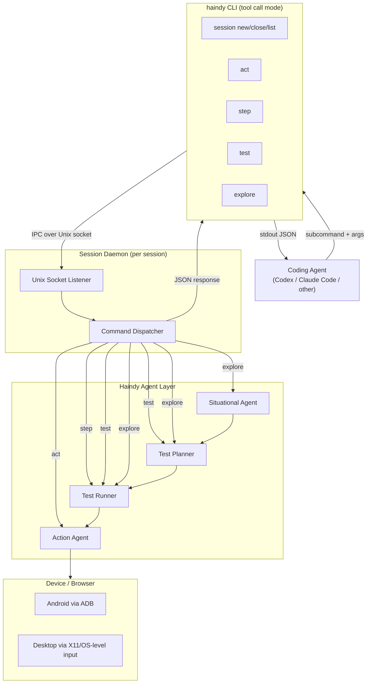

# Haindy Agentic Mode - Overview

## Problem

Haindy is a capable autonomous testing agent, but its current interface (file-based plan + context) is designed for human operators. Coding agents like Codex or Claude Code cannot easily drive Haindy as a tool within their own workflows.

The goal of tool call mode is to expose Haindy as a first-class tool that a coding agent can call from within its tool-use loop, enabling it to perform exploratory testing, validate features, and get structured feedback from a real device or browser - without leaving its own context.

## Design Philosophy

- **CLI over MCP/API**: A well-designed CLI paired with a skill requires less context and has better adoption than an MCP server or custom API. Coding agents are trained to use CLIs and can learn new ones via a skill loaded in-context.
- **Session-based**: A persistent session daemon keeps the device/browser alive between calls, avoiding expensive re-initialization on every command.
- **Layered abstraction**: Commands are tiered from direct device actions up to full test plans. The coding agent picks the right level of abstraction for its needs.
- **Stable JSON contract**: Every command returns the same JSON envelope. The `status` field is machine-readable. The `response` field is natural language that the coding agent can pass directly to the user or reason about.
- **Screenshot on every response**: Agents need visual grounding. Every response includes a path to the latest screenshot.

## Document Index

| Document | What it covers |
|---|---|
| [OVERVIEW.md](./OVERVIEW.md) | This file. Problem, philosophy, architecture diagram, glossary. |
| [CLI_SPEC.md](./CLI_SPEC.md) | Every command, subcommand, flag, argument, and the full JSON contract. |
| [SESSION_DAEMON.md](./SESSION_DAEMON.md) | Session daemon internals, lifecycle, IPC protocol, sequence diagrams. |
| [SKILL_SPEC.md](./SKILL_SPEC.md) | The Claude Code skill design: what it teaches, example interactions. |

---

## High-Level Architecture



### Component Roles

**CLI client** (`haindy <subcommand>`): Thin wrapper. Locates the session daemon socket from `HAINDY_SESSION` env var or positional session ID, sends the command over IPC, waits for the JSON response, prints to stdout, exits with code 0 (success) or 1 (failure/error).

**Session Daemon**: A long-running Python process spawned by `haindy session new`. Owns the device or desktop connection. Listens on a Unix socket at `~/.haindy/sessions/<id>/daemon.sock`. Dispatches incoming commands to the appropriate agent and returns JSON.

**Action Agent**: Receives a natural language instruction, takes a screenshot, identifies the target element, and executes a single interaction (tap, click, type, scroll). Returns immediately with the result.

**Test Runner**: Interprets a step as a sequence of actions plus an expected outcome. Drives the Action Agent in a loop until the expected result is achieved or the step fails. Returns a pass/fail with explanation.

**Test Planner**: Accepts a high-level objective and produces a structured sequence of steps. Used by the `test` command.

**Situational Agent**: Assesses context and prepares the entrypoint (navigates to the right URL, launches the right app, etc.). Currently operates on text context, not live screen state. Full live-screen situational assessment is planned for v2 as part of the `explore` command.

---

## Command Abstraction Hierarchy

Each command maps to a different level of the agent stack:

```
[v2] explore  ──►  Situational Agent + Test Planner + Test Runner + Action Agent
     test     ──►  Test Planner + Test Runner + Action Agent
     step     ──►  Test Runner + Action Agent
     act      ──►  Action Agent only
```

The coding agent should pick the lowest level that gives it what it needs:
- Use `act` when the exact interaction is known and no validation is needed.
- Use `step` when a natural language action + expected result is sufficient.
- Use `test` when a multi-step scenario needs to be planned and validated end-to-end.
- `explore` is planned for v2. Use `test` for open-ended scenarios in v1.

---

## JSON Response Envelope

Every command returns a single JSON object on stdout:

```json
{
  "session_id": "string",
  "command": "act | step | test | explore | session",
  "status": "success | failure | error",
  "response": "Natural language description of what happened. Always present. Especially detailed on failure.",
  "screenshot_path": "/absolute/path/to/latest/screenshot.png"
}
```

| Field | Always present | Notes |
|---|---|---|
| `session_id` | Yes | Echoed from the active session. |
| `command` | Yes | The subcommand that was run. |
| `status` | Yes | Machine-readable signal. `error` means Haindy itself failed (bug/crash), `failure` means the action or assertion failed. |
| `response` | Yes | Human-readable. On success: what happened. On failure: what was expected vs. what was observed. |
| `screenshot_path` | Yes (when session active) | Absolute path to the latest screenshot. Absent if screenshot could not be taken. |

Exit codes mirror status: 0 for `success`, 1 for `failure` or `error`.

---

## Session Filesystem Layout

```
~/.haindy/
  sessions/
    <session-id>/
      daemon.sock        # Unix domain socket (IPC)
      daemon.pid         # Daemon process PID
      session.json       # Session metadata (backend, created_at, etc.)
      screenshots/       # Sequential screenshots from this session
        step_001.png
        step_002.png
        ...
      logs/
        daemon.log       # Structured daemon logs
```

---

## Glossary

| Term | Meaning |
|---|---|
| **Coding agent** | An AI coding assistant (Codex, Claude Code, etc.) using Haindy as a tool. |
| **Session** | A persistent connection to a device or browser, identified by a UUID. |
| **Session daemon** | The background process that owns the device connection and dispatches commands. |
| **Skill** | A context-injection file that teaches a coding agent how to use `haindy` in tool call mode. Placed per-agent (e.g. `.claude/skills/` for Claude Code). |
| **IPC** | Inter-process communication between CLI client and daemon, over a Unix domain socket. |
| **act** | A single direct device interaction with no outcome validation. |
| **step** | A natural language instruction + expected outcome, interpreted and validated by the Test Runner. |
| **test** | A full test scenario run through the Planner and Runner. |
| **explore** | (v2) An open-ended goal handled by the full agent stack including live-screen situational assessment. |
