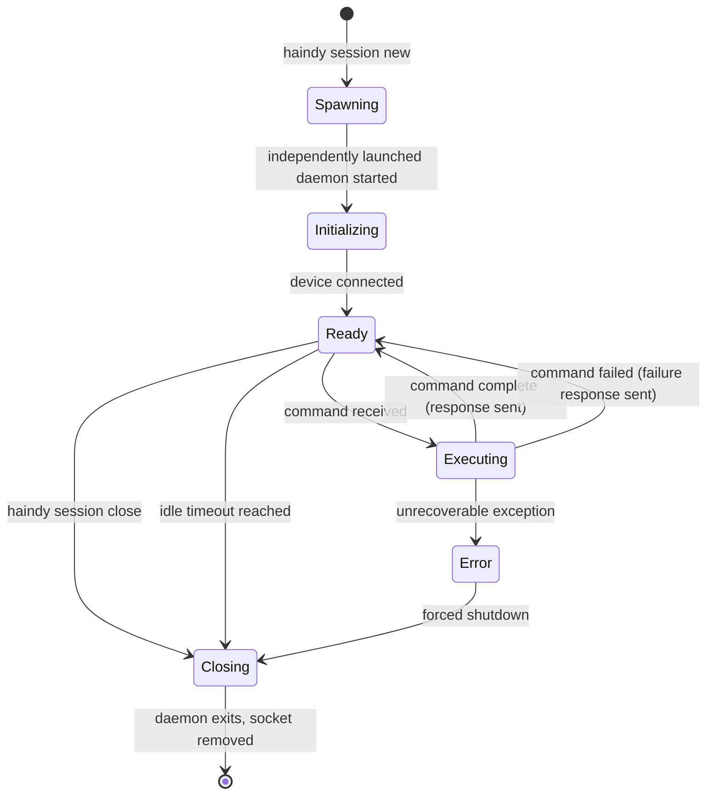
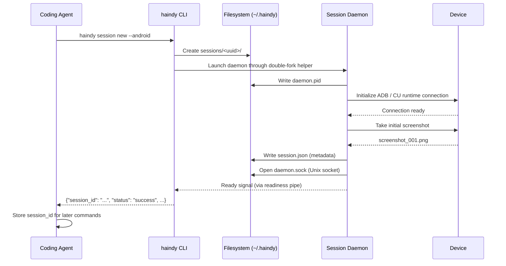
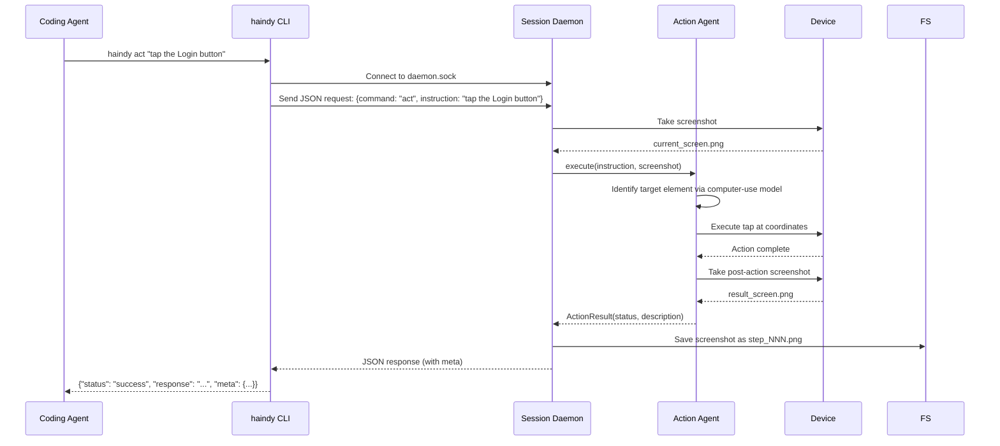
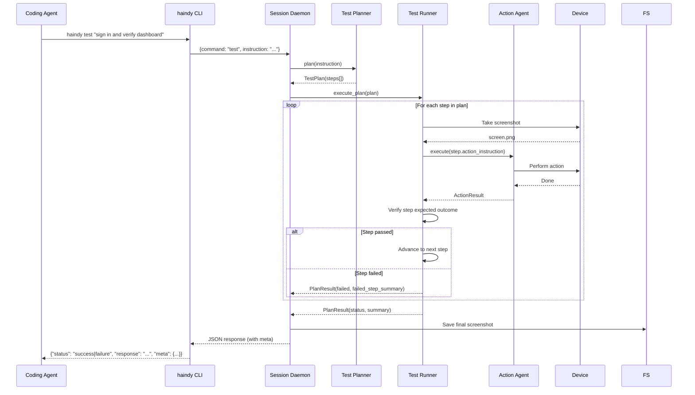

# Haindy Tool Call Mode - Session Daemon Design

## Why a Daemon

The ADB device connection and desktop computer-use runtime are expensive to initialize (1-5 seconds each). In tool call mode, a coding agent may issue dozens of commands in sequence. Re-initializing the device connection on every CLI invocation would make each `haindy act` call unacceptably slow and would break stateful navigation (app/page state is lost on each reconnect).

The session daemon is a long-running Python process that:
- Owns a single device connection for the lifetime of the session
- Listens on a Unix domain socket for commands from CLI clients
- Dispatches commands to the appropriate Haindy agents
- Keeps agent instances warm between calls (no re-instantiation overhead)
- Writes screenshots and logs to the session directory

---

## Session Lifecycle



---

## Session Initialization Sequence



**Readiness pipe**: The daemon inherits a write-end file descriptor from the CLI process. When the socket is open and the device is ready, it writes a single byte to signal readiness. The CLI blocks on the read-end until it receives this signal or a startup timeout fires (default: 30s). This avoids polling and race conditions.

---

## Command Dispatch Sequence: `act`



`session status` is also handled by the Action Agent, but in observe-only mode: it captures the current screen and returns a natural-language description without executing any device interaction.

---

## Command Dispatch Sequence: `test`



---

## Command Dispatch Sequence: `explore` (v2 - not yet implemented)

Placeholder for the v2 `explore` command. Requires live-screen situational assessment: the Situational Agent will take a screenshot, describe the current device state, and feed that into the Test Planner before execution begins. The sequence will be similar to `test` with a Situational Agent assessment step prepended.

---

## IPC Protocol

Communication between the CLI client and daemon uses newline-delimited JSON over a Unix domain socket.

### Request format

```json
{
  "command": "act | test | session_status | session_close | session_set | session_unset | session_vars",
  "instruction": "string (for act/test)",
  "options": {
    "max_steps": 20,
    "timeout_seconds": 300,
    "force": false
  },
  "var_name": "string (for session_set/session_unset)",
  "var_value": "string (for session_set)",
  "var_secret": "boolean (for session_set)"
}
```

### Response format

The full JSON response envelope (as defined in CLI_SPEC.md). Sent as a single line terminated by `\n`. The CLI reads until `\n` and exits.

### Error handling

If the daemon crashes mid-command, the socket connection is closed before a response is sent. The CLI detects EOF on the socket and emits an error envelope:

```json
{
  "session_id": "...",
  "command": "...",
  "status": "error",
  "response": "Haindy daemon connection lost mid-command. The daemon may have crashed. Check ~/.haindy/sessions/<id>/logs/daemon.log.",
  "screenshot_path": null,
  "meta": {"exit_reason": "agent_error", "duration_ms": 0, "actions_taken": 0}
}
```

---

## Session Daemon Process Management

### Spawning

The CLI launches the daemon through a narrow double-fork helper so the long-lived
session process is not tied to the lifetime of the `session new` client
process. The launcher:

- resolves the canonical HAINDY CLI entrypoint (`haindy` when installed, otherwise `python -m src.main`)
- creates the readiness pipe and passes its write end through `HAINDY_READINESS_FD`
- performs `fork`, `setsid()`, and a second `fork`
- redirects stdin/stdout/stderr to `/dev/null`
- `exec`s the hidden `__tool_call_daemon` entrypoint in the grandchild

The daemon receives:
- `--session-id <uuid>` - its own session ID
- `--backend <android|desktop>` - device backend to initialize
- A file descriptor number for the readiness pipe (via env var `HAINDY_READINESS_FD`)

### Idle timeout

The daemon tracks the last command time. If no command is received within `--idle-timeout` seconds (default: 1800), it initiates a clean shutdown. This prevents leaked daemon processes after a coding agent session ends unexpectedly.

### Crash recovery

If the daemon exits unexpectedly (crash, OOM, SIGKILL), the session directory and socket file may remain on disk. `haindy session new` opportunistically cleans up stale session artifacts from dead daemons before creating a new session. `haindy session list` reports only live sessions.

The daemon also records explicit shutdown notes for externally delivered
termination signals such as `SIGTERM` and `SIGHUP`, so wrapper-related process
death is visible in `session.json` and `logs/daemon.log` instead of appearing as
a silent disappearance.

### Command timeout

Every daemon-handled command is bounded by a wall-clock timeout. The caller may set it explicitly with `--timeout <seconds>`; otherwise the daemon uses the command default (300s for `test`, `act`, and `session status`).

If the timeout is reached, the daemon stops the command and returns:

```json
{
  "session_id": "...",
  "command": "...",
  "status": "error",
  "response": "Command timed out before completion. The session is still alive and can accept another command.",
  "screenshot_path": "/absolute/path/to/latest/screenshot.png",
  "meta": {"exit_reason": "command_timeout", "duration_ms": 300000, "actions_taken": 4}
}
```

### Clean shutdown

`haindy session close` sends a `session_close` command over the socket. The daemon:
1. Finishes any in-progress command
2. Closes the device connection
3. Writes a final summary to `session.json`
4. Removes `daemon.sock`
5. Exits

`haindy session close --force` skips the graceful wait and terminates the daemon immediately. Use this to recover a stuck session after a timeout or other non-responsive state.

### Foreground fallback

The hidden daemon entrypoint remains available for local debugging, integration
tests, and hostile wrappers that kill all detached descendants:

```bash
python -m src.main __tool_call_daemon --session-id <SESSION_ID> --backend desktop
```

This is an operational fallback, not the primary V1 path.

---

## Session Directory Lifecycle

```
~/.haindy/sessions/<uuid>/
    daemon.sock    # Created when daemon is ready. Removed on close.
    daemon.pid     # Written immediately on spawn. Used for orphan detection.
    session.json   # Written on ready. Updated on close with final stats.
    screenshots/
        step_001.png   # Numbered sequentially across all commands.
        step_002.png
        ...
    logs/
        daemon.log     # Rotating structured log for this session.
```

Session directories are not automatically deleted after close. They serve as an audit trail. A separate `haindy session prune --older-than <days>` command can clean them up.

---

## Concurrency

The daemon is single-threaded per session. It processes one command at a time. If a second CLI process connects while a command is executing, it receives a `status: error` response:

```json
{
  "session_id": "...",
  "command": "...",
  "status": "error",
  "response": "Session is busy executing a previous command. Retry when the current command completes.",
  "screenshot_path": null,
  "meta": {"exit_reason": "session_busy", "duration_ms": 0, "actions_taken": 0}
}
```

This is intentional. Device state is inherently sequential. Parallel commands on the same session would produce undefined behavior.

---

## Implementation Notes

- The daemon is implemented as a Python asyncio server using `asyncio.start_unix_server`.
- Agent instances (ActionAgent, TestRunner, etc.) are created once at daemon startup and reused across commands, preserving any in-memory caches (e.g., coordinate caches).
- The `WorkflowCoordinator` is not used in tool call mode. The daemon dispatches directly to agents. This avoids the planning overhead that is part of the full `run_test` flow.
- Screenshots are taken by the daemon (not the CLI) and written to the session screenshots directory. The response includes the absolute path. The coding agent is responsible for reading the file if it needs the image content.
