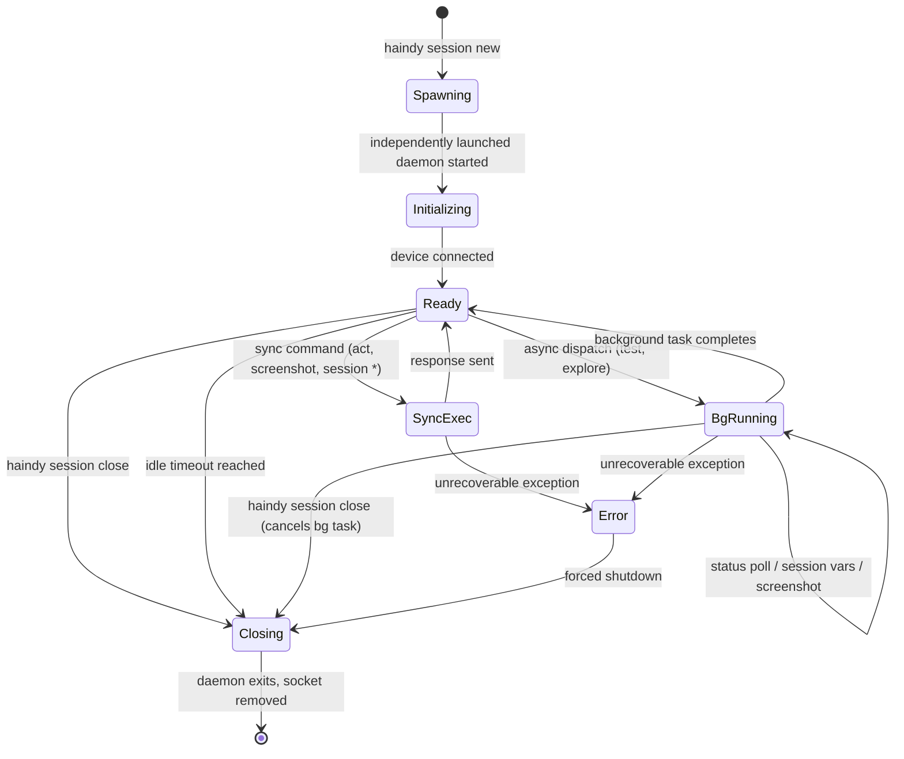
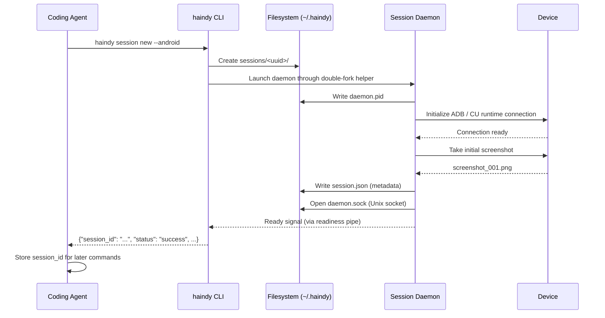
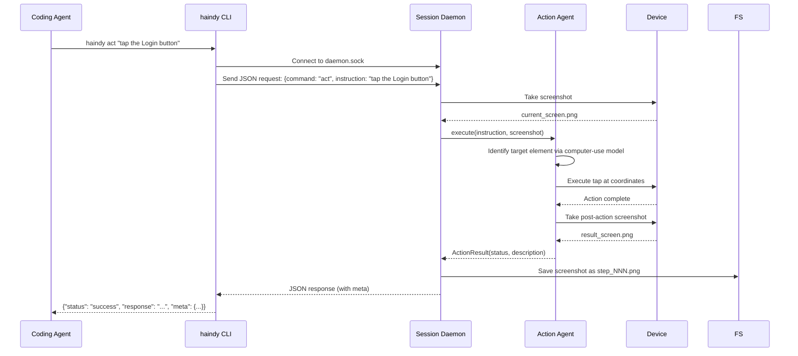
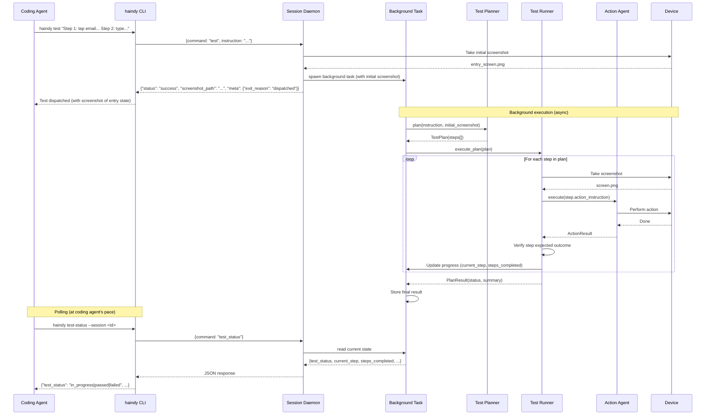
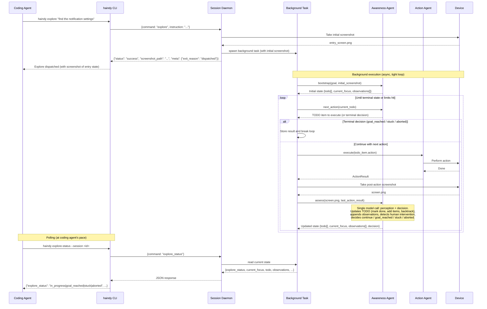

# Haindy Tool Call Mode - Session Daemon Design

## Why a Daemon

The ADB device connection and desktop computer-use runtime are expensive to initialize (1-5 seconds each). In tool call mode, a coding agent may issue dozens of commands in sequence. Re-initializing the device connection on every CLI invocation would make each `haindy act` call unacceptably slow and would break stateful navigation (app/page state is lost on each reconnect).

The session daemon is a long-running Python process that:
- Owns a single device connection for the lifetime of the session
- Listens on a Unix domain socket for commands from CLI clients
- Dispatches commands to the appropriate Haindy agents
- Keeps agent instances warm between calls (no re-instantiation overhead)
- Writes screenshots and logs to the session directory

---

## Session Lifecycle



The daemon distinguishes between synchronous commands (which block until done) and background tasks (which run asynchronously). While a background task is running:

- **Allowed**: `test-status`, `explore-status`, `session set/unset/vars`, `session close`, `screenshot` (passive screen capture that does not interact with the device).
- **Rejected**: `act`, `session status`, `test`, `explore`. These either interact with the device (conflicting with the background task) or attempt to start a second background task. The daemon returns `session_busy`.

This ensures the background task has exclusive access to the device for interaction, while the coding agent can still poll progress, manage variables, and take passive screenshots.

---

## Session Initialization Sequence



**Readiness pipe**: The daemon inherits a write-end file descriptor from the CLI process. When the socket is open and the device is ready, it writes a single byte to signal readiness. The CLI blocks on the read-end until it receives this signal or a startup timeout fires (default: 30s). This avoids polling and race conditions.

---

## Command Dispatch Sequence: `act`



`session status` is also handled by the Action Agent, but in observe-only mode: it captures the current screen and returns a natural-language description without executing any device interaction.

---

## Command Dispatch Sequence: `test` (async)



---

## Command Dispatch Sequence: `explore` (async)



The `explore` loop is intentionally tight: one Awareness Agent call per iteration that combines perception (what is on the screen), bookkeeping (update TODO and observations), and decision (continue, reach goal, give up, abort). The Awareness Agent calls the Action Agent directly for the next TODO item -- there is no Test Planner or Test Runner in this path, so there is no up-front plan to invalidate when assumptions turn out to be wrong.

The TODO list is the agent's working memory. It is mutable: the Awareness Agent may add new items when it discovers a new screen, reorder items when it finds a shortcut, mark items `skipped` when they turn out to be unnecessary, and backtrack by pushing new items ahead of existing ones. The list is exposed verbatim in `explore-status` so the coding agent can see the trajectory.

The Awareness Agent also watches for signs of human intervention on every iteration. If the screen shows an app or state that Haindy did not cause (foreign app in focus, device returned to the launcher, emulator restarted, unexpected system UI), and it cannot be recovered by adding a TODO item, the agent sets the terminal state to `aborted` and the background task ends. Transient interruptions like notifications or consent dialogs are handled inline by adding TODO items to dismiss or respond to them.

---

## IPC Protocol

Communication between the CLI client and daemon uses newline-delimited JSON over a Unix domain socket.

### Request format

```json
{
  "command": "act | test | test_status | explore | explore_status | screenshot | session_status | session_close | session_set | session_unset | session_vars",
  "instruction": "string (for act/test/explore)",
  "options": {
    "max_steps": 20,
    "timeout_seconds": 300,
    "force": false
  },
  "var_name": "string (for session_set/session_unset)",
  "var_value": "string (for session_set)",
  "var_secret": "boolean (for session_set)"
}
```

### Response format

The full JSON response envelope (as defined in CLI_SPEC.md). Sent as a single line terminated by `\n`. The CLI reads until `\n` and exits.

### Error handling

If the daemon crashes mid-command, the socket connection is closed before a response is sent. The CLI detects EOF on the socket and emits an error envelope:

```json
{
  "session_id": "...",
  "command": "...",
  "status": "error",
  "response": "Haindy daemon connection lost mid-command. The daemon may have crashed. Check ~/.haindy/sessions/<id>/logs/daemon.log.",
  "screenshot_path": null,
  "meta": {"exit_reason": "agent_error", "duration_ms": 0, "actions_taken": 0}
}
```

---

## Session Daemon Process Management

### Spawning

The CLI launches the daemon through a narrow double-fork helper so the long-lived
session process is not tied to the lifetime of the `session new` client
process. The launcher:

- resolves the canonical HAINDY CLI entrypoint (`haindy` when installed, otherwise `python -m haindy.main`)
- creates the readiness pipe and passes its write end through `HAINDY_READINESS_FD`
- performs `fork`, `setsid()`, and a second `fork`
- redirects stdin/stdout/stderr to `/dev/null`
- `exec`s the hidden `__tool_call_daemon` entrypoint in the grandchild

The daemon receives:
- `--session-id <uuid>` - its own session ID
- `--backend <android|ios|desktop>` - device backend to initialize
- A file descriptor number for the readiness pipe (via env var `HAINDY_READINESS_FD`)

### Idle timeout

The daemon tracks the last command time. If no command is received within `--idle-timeout` seconds (default: 1800), it initiates a clean shutdown. This prevents leaked daemon processes after a coding agent session ends unexpectedly.

### Crash recovery

If the daemon exits unexpectedly (crash, OOM, SIGKILL), the session directory and socket file may remain on disk. `haindy session new` opportunistically cleans up stale session artifacts from dead daemons before creating a new session. `haindy session list` reports only live sessions.

The daemon also records explicit shutdown notes for externally delivered
termination signals such as `SIGTERM` and `SIGHUP`, so wrapper-related process
death is visible in `session.json` and `logs/daemon.log` instead of appearing as
a silent disappearance.

### Command timeout

Synchronous commands (`act`, `screenshot`, `session status`) are bounded by a wall-clock timeout. The caller may set it explicitly with `--timeout <seconds>`; otherwise the daemon uses the command default (300s for `act` and `session status`, 30s for `screenshot`).

If the timeout is reached, the daemon stops the command and returns:

```json
{
  "session_id": "...",
  "command": "...",
  "status": "error",
  "response": "Command timed out before completion. The session is still alive and can accept another command.",
  "screenshot_path": "/absolute/path/to/latest/screenshot.png",
  "meta": {"exit_reason": "command_timeout", "duration_ms": 300000, "actions_taken": 4}
}
```

### Background task timeout

For async commands (`test`, `explore`), the `--timeout` flag sets the wall-clock budget for the background task, not the dispatch. The dispatch itself is instant. If the background task exceeds its timeout, it stops and records `timeout` as its terminal state. The next `test-status` or `explore-status` poll returns this result.

For `test`, the default timeout is 300s. For `explore`, timeout is optional -- if omitted, explore runs until the goal is reached, the agent gets stuck, or max-steps is hit. The coding agent controls timing at its own level.

### Clean shutdown

`haindy session close` sends a `session_close` command over the socket. The daemon:
1. Finishes any in-progress command
2. Closes the device connection
3. Writes a final summary to `session.json`
4. Removes `daemon.sock`
5. Exits

`haindy session close --force` skips the graceful wait and terminates the daemon immediately. Use this to recover a stuck session after a timeout or other non-responsive state.

### Foreground fallback

The hidden daemon entrypoint remains available for local debugging, integration
tests, and hostile wrappers that kill all detached descendants:

```bash
python -m haindy.main __tool_call_daemon --session-id <SESSION_ID> --backend desktop
```

This is an operational fallback, not the primary V1 path.

---

## Session Directory Lifecycle

```
~/.haindy/sessions/<uuid>/
    daemon.sock    # Created when daemon is ready. Removed on close.
    daemon.pid     # Written immediately on spawn. Used for orphan detection.
    session.json   # Written on ready. Updated on close with final stats.
    screenshots/
        step_001.png   # Numbered sequentially across all commands.
        step_002.png
        ...
    logs/
        daemon.log     # Rotating structured log for this session.
```

Session directories are not automatically deleted after close. They serve as an audit trail. Use `haindy session prune --older-than <days>` to clean up old sessions (see CLI_SPEC.md).

---

## Concurrency

The daemon uses a single asyncio event loop. Device interaction is inherently sequential, so only one device-interacting operation runs at a time.

**Sync command locking**: Sync commands (`act`, `screenshot`, `session status`) acquire a command lock. If a sync command is already executing, subsequent sync requests receive `session_busy`.

**Background task exclusivity**: Only one background task (`test` or `explore`) runs at a time. Dispatching a second async command while one is active returns `session_busy`.

**Coexistence rules while a background task is running**:
- `test-status`, `explore-status`: always accepted (read-only state query).
- `session set/unset/vars`: always accepted (metadata, no device interaction).
- `screenshot`: accepted (passive screen capture, serialized with the background task's device access).
- `session close`: accepted (cancels the background task and shuts down).
- `act`, `session status`: rejected with `session_busy` (these interact with the device and would conflict with the background task).
- `test`, `explore`: rejected with `session_busy` (only one background task at a time).

```json
{
  "session_id": "...",
  "command": "...",
  "status": "error",
  "response": "Session is busy executing a background task. Use test-status or explore-status to check progress, or session close to cancel.",
  "screenshot_path": null,
  "meta": {"exit_reason": "session_busy", "duration_ms": 0, "actions_taken": 0}
}
```

---

## Implementation Notes

- The daemon is implemented as a Python asyncio server using `asyncio.start_unix_server`.
- Agent instances (ActionAgent, TestPlanner, TestRunner, AwarenessAgent) are created once at daemon startup and reused across commands, preserving any in-memory caches (e.g., coordinate caches). The standard-mode SituationalAgent is not instantiated by the daemon -- tool call mode uses the AwarenessAgent for live-screen perception instead.
- The `WorkflowCoordinator` is not used in tool call mode. The daemon dispatches directly to agents. This avoids the planning overhead that is part of the full `run_test` flow.
- Background tasks (`test`, `explore`) run as asyncio tasks within the daemon's event loop. The daemon maintains a reference to the active background task and its progress state. Status polls read this state without blocking.
- The `explore` command uses a tight two-agent loop: the Awareness Agent maintains a living TODO list and calls the Action Agent directly for each next action, reassessing after every action. There is no Test Planner or Test Runner in the explore path. Each iteration updates `todo`, `observations`, and `current_focus` visible to `explore-status`. The Awareness Agent also detects human intervention (device moved, foreign app focused, emulator restarted) and can terminate the loop with `aborted`.
- Screenshots are taken by the daemon (not the CLI) and written to the session screenshots directory. The response includes the absolute path. The coding agent is responsible for reading the file if it needs the image content. The coding agent can also take its own screenshots via the `screenshot` command at its own timing.
